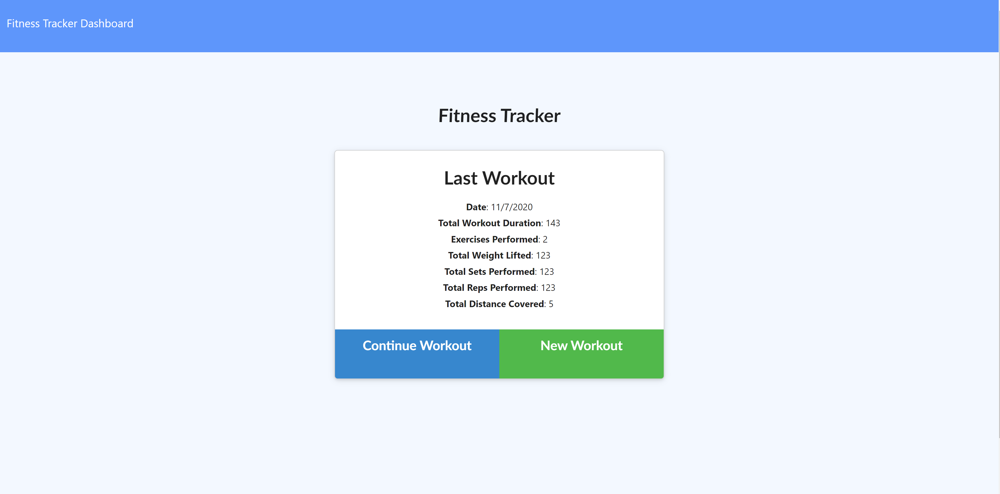

# Fitness Friend

I created a fitness tracking application that was built with Express, Node.js and has a MongoDB database. You can enter in your workouts and choose if the workout is a cardio or a resistance exercises. The application then allows you to see all of the information regarding your combined workouts and well ad clean, slick charts showing you your workout progress.

## Screenshot of Application

## Built With
* [HTML](https://developer.mozilla.org/en-US/docs/Web/HTML)
* [CSS](https://developer.mozilla.org/en-US/docs/Web/CSS)
* [Javascript](https://developer.mozilla.org/en-US/docs/Web/JavaScript)
* [Node.js](https://nodejs.org/en/)
* [Express.js](http://expressjs.com/)
* [MongoDB](https://www.mongodb.com/)

## Author

* **Ryan Nemec** 

- [Link to Portfolio Site](https://perfectoment.github.io/Ryan-Portfolio/)
- [Link to Github](https://github.com/perfectoment)
- [Link to LinkedIn](https://www.linkedin.com/in/ryan-nemec-5a6b3a66/)